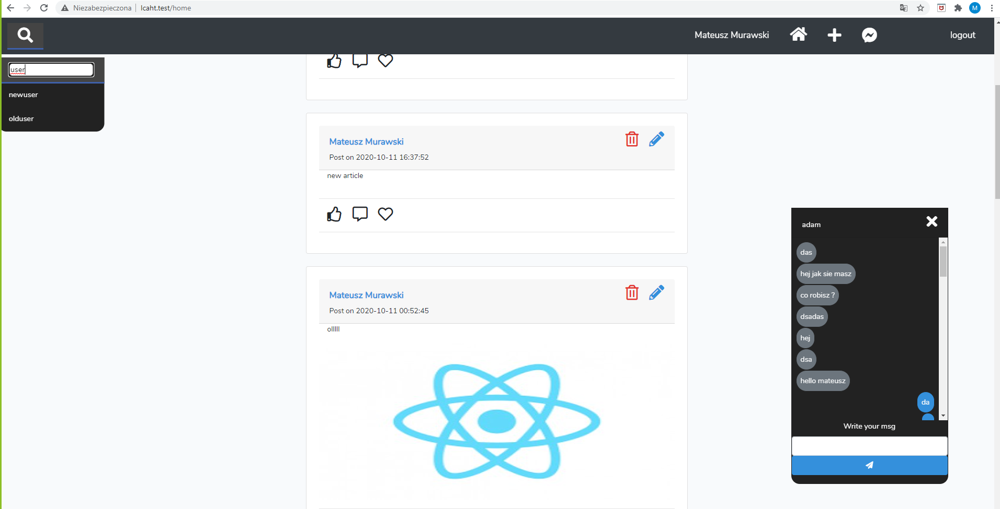

Facbook Clone Application with Laravel and Vue
Application options
1.Register/Login to application.

2.Looking for friends.

3.Chatting with friends

4.Creating posts, deleteing your own Post

5.Commenting on posts

